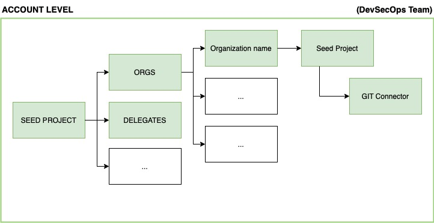

# Harness Account provisioning with Terraform

This repo contains all the necessary to provision and onboard a new Harness account and will create the following architecture



### **Directory**

Implementation code is organized with the following structure


```bash
.
├── contrib
│   ├── docker
│   │   └── devcontainer.Dockerfile
│   ├── fixtures
│   │   └── harness-tf.jpg
│   ├── manifests
│   │   └── delegate-example.yml
│   └── scripts
│       ├── apply
│       ├── destroy
│       ├── plan
│       └── start
├── harness-provision
│   ├── cristian-delegate-tf-harness-delegate.yml
│   ├── delegate-init.tf
│   ├── main.tf
│   ├── provider.tf
│   ├── templates
│   │   ├── inputsets
│   │   │   └── tf_account_setup_inputset_apply.tpl
│   │   └── pipelines
│   │       ├── delegate_init.tpl
│   │       └── tf_account_setup.tpl
│   └── variables.tf
└── tfvars
    └── cristian
        ├── account.tfvars
        ├── connectors.tfvars
        ├── delegates.tfvars
        └── pipelines.tfvars

```
